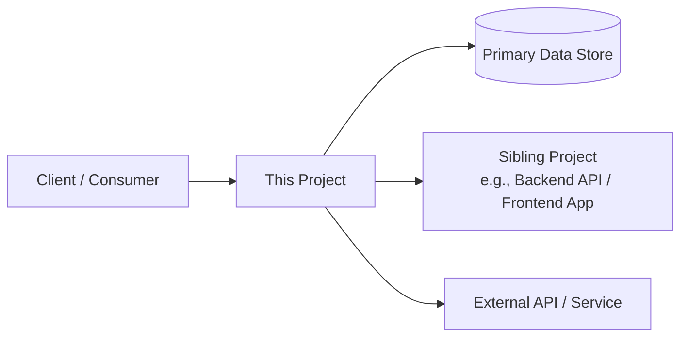

# Architecture Overview
This document serves as a critical, living reference designed to equip agents with a rapid and comprehensive understanding of this project's architecture, enabling efficient navigation and effective contribution from day one. It describes a **single project/service**: related projects (for example a separate frontend or backend that this one talks to) are documented in their own `ARCHITECTURE.md` and referenced here as external systems. Its contents reflect the project's **actual, verified architecture** — facts come from the codebase or from the team, never from guesswork. Keep this document up to date as the codebase evolves.

## 1. Project Identification

Project Name: [Insert Project Name]

Project Role: [e.g., Backend API, Frontend Web App, Worker / Background Service]

Repository URL: [Insert Repository URL]

Primary Contact/Team: [Insert Lead Developer/Team Name]

Date of Last Update: [YYYY-MM-DD]

## 2. Project Structure
This section provides a high-level overview of this project's directory and file structure, categorised by architectural layer or major functional area. It is essential for quickly navigating the codebase, locating relevant files, and understanding the overall organization and separation of concerns. Show only the structure of THIS project (not sibling projects).

[Project Root]/
├── src/                  # Main source code for this project
│   ├── [layer-1]/        # e.g., api/ (entrypoints, controllers, routes)
│   ├── [layer-2]/        # e.g., services/ (business logic)
│   ├── [layer-3]/        # e.g., models/ (data models / schemas)
│   └── [layer-4]/        # e.g., utils/ (shared helpers)
├── config/               # Configuration files
├── tests/                # Unit and integration tests
├── scripts/              # Automation scripts (deployment, data seeding, etc.)
├── docs/                 # Project documentation
├── .github/              # CI/CD configuration (GitHub Actions, etc.)
├── Dockerfile            # Container build for deployment
├── .gitignore            # Specifies intentionally untracked files to ignore
├── README.md             # Project overview and quick start guide
└── ARCHITECTURE.md       # This document

## 3. High-Level System Diagram
Provide a **Mermaid** diagram showing how THIS project fits into its wider context: who calls it, what it depends on, and where its boundaries are. Sibling projects (e.g., the separate frontend or backend) and external services appear here as neighbouring nodes, not as internal parts. Replace the example below with the project's real components and relationships.

## 4. Core Components
(List and briefly describe the main INTERNAL components or modules of this project. For each, include its primary responsibility, where it lives in the codebase, and key technologies used. Add or remove component blocks as needed — there is no fixed number.)

### 4.1. [Component / Module Name 1]

Responsibility: [Briefly describe what this component does, e.g., "Exposes the public REST API and handles request validation."]

Location: [e.g., src/api/]

Technologies: [e.g., FastAPI, Pydantic]

### 4.2. [Component / Module Name 2]

Responsibility: [Briefly describe its purpose.]

Location: [e.g., src/services/]

Technologies: [e.g., SQLModel, asyncio]

## 5. Data Stores

(List and describe the databases and other persistent storage solutions THIS project owns or accesses directly.)

### 5.1. [Data Store Type 1]

Name: [e.g., Primary Database]

Type: [e.g., PostgreSQL, MongoDB, Redis, S3, Firestore]

Purpose: [Briefly describe what data it stores and why.]

Key Schemas/Collections: [List important tables/collections, e.g., users, products, orders (no need for full schema, just names)]

### 5.2. [Data Store Type 2]

Name: [e.g., Cache, Message Queue]

Type: [e.g., Redis, Kafka, RabbitMQ]

Purpose: [Briefly describe its purpose, e.g., "Used for caching frequently accessed data" or "Inter-service communication."]

## 6. External Integrations / APIs

(List external dependencies of THIS project: third-party services, external APIs, AND sibling projects it talks to — for example, the separate backend API that this frontend consumes, or the frontend that consumes this backend.)

Service Name 1: [e.g., Sibling Backend API, Stripe, SendGrid]

Purpose: [Briefly describe its function, e.g., "Provides the data this app renders" or "Payment processing."]

Integration Method: [e.g., REST API, gRPC, SDK, message queue]

## 7. Deployment & Infrastructure

Cloud Provider / Host: [e.g., AWS, GCP, Azure, On-premise, self-hosted VPS]

Key Services Used: [e.g., EC2, Lambda, S3, RDS, Kubernetes, Docker, Nginx]

CI/CD Pipeline: [e.g., GitHub Actions, GitLab CI, Jenkins]

Monitoring & Logging: [e.g., Prometheus, Grafana, CloudWatch, ELK Stack]

## 8. Security Considerations

(Highlight any critical security aspects, authentication mechanisms, or data encryption practices for this project.)

Authentication: [e.g., OAuth2, JWT, API Keys]

Authorization: [e.g., RBAC, ACLs]

Data Encryption: [e.g., TLS in transit, AES-256 at rest]

Key Security Tools/Practices: [e.g., WAF, regular security audits]

## 9. Development & Testing Environment

Local Setup Instructions: [Link to CONTRIBUTING.md or brief steps]

Testing Frameworks: [e.g., Jest, Pytest, JUnit]

Code Quality Tools: [e.g., ESLint, Black, Ruff, SonarQube]

## 10. Future Considerations / Roadmap

(Briefly note any known architectural debts, planned major changes, or significant future features that might impact this project's architecture.)

[e.g., "Extract the notifications module into its own service."]

[e.g., "Introduce a read replica for reporting queries."]

## 11. Glossary / Acronyms

(Define any project-specific terms or acronyms.)

[Acronym]: [Full Definition]

[Term]: [Explanation]
