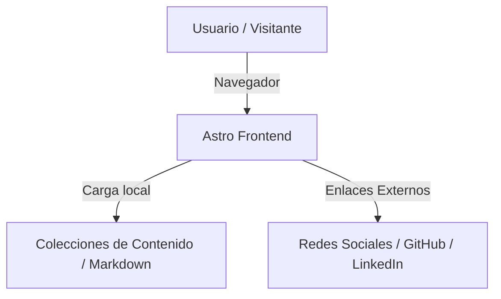

# Descripción General de la Arquitectura
Este documento sirve como una referencia crítica y viva diseñada para equipar a los desarrolladores y agentes con una comprensión rápida y completa de la arquitectura de este proyecto, permitiendo una navegación eficiente y una contribución efectiva desde el primer día. Describe un **único proyecto/servicio**: los proyectos relacionados se documentan en su propio `ARCHITECTURE.md` y se referencian aquí como sistemas externos. Sus contenidos reflejan la **arquitectura real y verificada** del proyecto; los hechos provienen de la base de código o del equipo, nunca de conjeturas. Mantenga este documento actualizado a medida que evolucione la base de código.

## 1. Identificación del Proyecto

Nombre del Proyecto: Juan Quintero - Gruvbox Transformación / Personal Website

Rol del Proyecto: Frontend Web App (Landing Page de presentación personal)

URL del Repositorio: _(TBD)_

Contacto Principal/Equipo: Juan Quintero

Fecha de Última Actualización: 2026-06-21

## 2. Estructura del Proyecto
Esta sección proporciona una visión general de alto nivel de la estructura de directorios y archivos de este proyecto, categorizada por capa arquitectónica o área funcional principal. Es esencial para navegar rápidamente por el código fuente, localizar archivos relevantes y comprender la organización general y la separación de conceptos. Muestra únicamente la estructura de ESTE proyecto.

```
[Project Root]/
├── public/                 # Recursos estáticos directos (favicons, imágenes sin procesar)
├── src/                    # Código fuente principal de la aplicación Astro
│   ├── components/         # Componentes de interfaz de usuario reutilizables (Hero, Terminal, etc.)
│   ├── content/            # Colecciones de contenido (artículos, proyectos en formato Markdown/MDX)
│   ├── layouts/            # Plantillas de diseño global de páginas (Layout.astro)
│   ├── pages/              # Páginas y enrutamiento basado en archivos (index.astro)
│   └── styles/             # Hojas de estilo globales (global.css con variables de diseño)
├── astro.config.mjs        # Configuración de Astro
├── package.json            # Dependencias y scripts del proyecto Node.js
├── tsconfig.json           # Configuración de TypeScript para Astro
├── DESIGN.md               # Guía de diseño visual y de marca (Gruvbox)
└── ARCHITECTURE.md         # Este documento
```

## 3. Diagrama del Sistema de Alto Nivel
A continuación se presenta un diagrama en **Mermaid** que muestra cómo encaja ESTE proyecto en su contexto general: quién lo accede, de qué depende y cuáles son sus límites.



## 4. Componentes Principales

### 4.1. Componentes de Interfaz de Usuario (UI)
Responsabilidad: Elementos visuales reutilizables que estructuran la Landing Page, siguiendo los lineamientos de diseño retro de Gruvbox definidos en DESIGN.md.

Ubicación: `src/components/`

Tecnologías: Astro, HTML, Vanilla CSS

Componentes previstos:
- `Hero.astro`: Sección de presentación principal con el mensaje de transformación.
- `Terminal.astro`: Consola interactiva retro que acepta comandos simulados.
- `Experience.astro`: Showcase de proyectos, trayectoria y habilidades.
- `Blog.astro`: Listado y visualización de artículos/tutoriales de divulgación.
- `Socials.astro`: Enlaces y accesos a redes profesionales.

### 4.2. Plantillas de Diseño (Layouts)
Responsabilidad: Proporcionar la estructura HTML base (`Layout.astro`) para todas las páginas del sitio, importando las tipografías correspondientes (JetBrains Mono para encabezados y UI, IBM Plex Sans para el cuerpo de texto) y aplicando las configuraciones de SEO básicas.

Ubicación: `src/layouts/`

Tecnologías: Astro

### 4.3. Hojas de Estilo y Sistema de Diseño (Styles)
Responsabilidad: Centralizar la identidad visual del proyecto. Define las variables CSS asociadas a la paleta Gruvbox (Primary, Secondary, Tertiary, Neutral, Surface, On-Surface), el espaciado estricto y las animaciones sin desenfoque (Zero Gravity).

Ubicación: `src/styles/`

Tecnologías: Vanilla CSS

## 5. Almacenamiento de Datos

### 5.1. Colecciones de Contenido (Content Collections)
Nombre: Content Store Local

Tipo: Archivos Markdown / MDX

Propósito: Almacenar la información estructurada de los proyectos del portafolio y los artículos del blog de manera local y versionada junto con el código fuente.

## 6. Integraciones Externas / APIs
No se contemplan integraciones con APIs dinámicas de terceros o backend propio en esta fase inicial. El sitio es puramente estático.

Servicio Externo 1: Redes Sociales (GitHub, LinkedIn, Twitter/X)

Propósito: Redireccionamiento para contacto y redes profesionales.

Método de Integración: Enlaces HTML estándar (a través de `Socials.astro`).

## 7. Despliegue e Infraestructura

Proveedor en la Nube / Hosting: _(TBD)_

Servicios Clave Utilizados: Astro (Static Site Generation - SSG)

Pipeline de CI/CD: _(TBD)_

Monitoreo y Logs: No aplica en esta fase estática.

## 8. Consideraciones de Seguridad

Autenticación: No requerida (sitio público estático).

Autorización: No requerida.

Encriptación de Datos: HTTPS en tránsito gestionado por el proveedor de hosting final.

Herramientas/Prácticas de Seguridad Clave: Uso de dependencias actualizadas en `package.json` para evitar vulnerabilidades conocidas.

## 9. Entorno de Desarrollo y Pruebas

Instrucciones de Configuración Local:
1. Clonar el repositorio.
2. Ejecutar `npm install` para instalar dependencias.
3. Ejecutar `npm run dev` para iniciar el servidor de desarrollo local en `http://localhost:4321`.
4. Ejecutar `npm run build` para compilar el sitio estático en la carpeta `dist/`.

Frameworks de Pruebas: _(TBD)_

Herramientas de Calidad de Código: Prettier / ESLint (previsto en la inicialización del proyecto Astro)

## 10. Consideraciones Futuras / Hoja de Ruta

- **Integración de CI/CD**: Configurar GitHub Actions para desplegar automáticamente a la plataforma seleccionada (ej. GitHub Pages o Vercel) al hacer push a la rama principal.
- **Automatización de Contenido**: Extender el soporte de markdown para incluir elementos interactivos personalizados mediante MDX dentro del blog/tutoriales.
- **Formulario de Contacto**: Si se requiere un formulario funcional en el futuro, integrar un servicio serverless (como Netlify Forms, Formspree o una función serverless dedicada).

## 11. Glosario / Acrónimos

- **Astro**: Framework web moderno diseñado para construir sitios web rápidos centrados en contenido a través de generación estática.
- **Gruvbox**: Paleta de colores retro retro-cálida muy popular en entornos de desarrollo, caracterizada por sus tonos pastel suaves y contraste agradable a la vista.
- **SSG (Static Site Generation)**: Generación de Sitios Estáticos. Proceso mediante el cual el sitio se pre-compila en archivos HTML, CSS y JS antes de ser desplegado.
